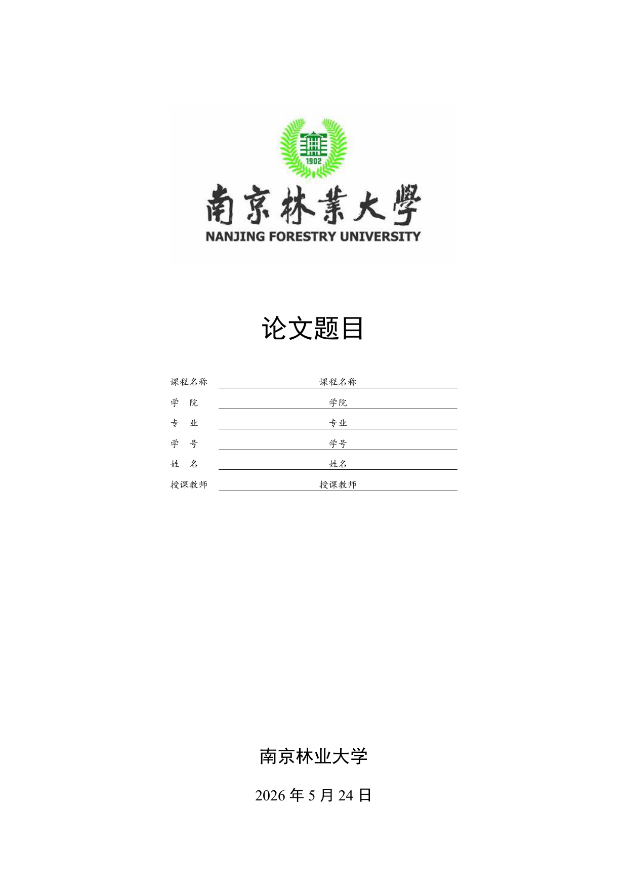

# NJFU-LaTeX-Template — 南京林业大学课程论文 LaTeX 模板

[](LICENSE)
[](https://tug.org/texlive/)
[](https://github.com/XCmiaow/NJFU-LaTeX-Template/actions/workflows/build.yml)

南林课程论文 LaTeX 模板，基于 `ctexart` + **XeLaTeX** 编译。

## 普通同学下载

第一次使用请下载 [最新 Release](https://github.com/XCmiaow/NJFU-LaTeX-Template/releases/latest) 里的 `njfu-course-paper-*-overleaf.zip`，上传到 Overleaf 后把编译器设为 **XeLaTeX**。

详细步骤见 [第一次使用完整流程](docs/student-quickstart.md)。完全没用过 Overleaf 时，先看 [Overleaf 手把手使用教程](docs/overleaf-step-by-step.md)。

不知道该改哪个文件时，看 [模板文件地图](docs/template-map.md)。需要插入图片、表格、公式或参考文献时，看 [写作配方](docs/writing-recipes.md)。想看一篇示例论文怎么从模板改出来，看 [第一篇课程论文完整演示](docs/first-paper-walkthrough.md)。

<p align="center">
  
</p>

## 适用范围

本项目面向南京林业大学课程论文写作，适合课程作业、课程结课论文、课程设计说明文档等轻量论文场景。

本项目不是学校官方模板，也不是毕业论文、学位论文、开题报告或其他正式培养环节材料的模板。提交前请以任课教师、学院或学校发布的具体格式要求为准。

## 概览

本仓库包含：

- **NJFUReport.sty** — 核心样式宏包（字体、页眉、三线表、数学环境、算法、附录等）
- **templates/** — 开箱即用的模板项目，可直接用于写论文
- **example.pdf** — 编译好的示例文档，下载前预览效果
- 一份完整的示例论文（[main.tex](main.tex)），展示模板的全部特性

> 📖 想看看效果？直接下载根目录的 [example.pdf](example.pdf) 预览完整示例。

## 目录结构

```text
├── NJFUReport.sty           核心样式（宏包、字体、页眉、三线表……）
├── main.tex                 主控文件（示例论文）
├── reference.bib            参考文献数据库
├── latexmkrc                自动编译配置
├── settings/
│   └── commands.tex         自定义命令
├── frontmatter/
│   ├── cover.tex            封面（支持盲审模式）
│   └── abstract.tex         中英文摘要
├── sections/                各章节正文
├── img/                     图片资源
├── templates/
│   ├── njfu-course-paper/   标准模板（通用课程论文）
│   └── personal-quickstart/ 极速开写模板（信息预填）
└── .github/workflows/       CI 自动编译验证
```

## 前置条件

| 依赖 | 说明 |
| --- | --- |
| TeX Live 2024+ / MiKTeX | 推荐 TeX Live |
| XeLaTeX | 主编译器 |
| BibTeX | 参考文献处理 |
| 中文字体 | Windows 默认使用 SimSun, SimHei, KaiTi, FangSong；其他系统自动尝试 Noto CJK / Fandol |

> **macOS/Linux 用户**：推荐安装 Noto CJK 字体。模板会自动尝试常见字体，
> 如果仍找不到中文字体，再修改 `NJFUReport.sty` 中的字体配置。

### 必备宏包

以下宏包由 `NJFUReport.sty` 自动加载，需确保 TeX 发行版已安装：

| 宏包 | 用途 | 安装（如缺失） |
| --- | --- | --- |
| `diagbox` | 表格斜线 | `tlmgr install diagbox pict2e` |
| `algorithm2e` | 伪代码 | `tlmgr install algorithm2e ifoddpage needspace relsize` |
| `appendix` | 附录 | `tlmgr install appendix` |

## 快速开始

### Overleaf（在线，推荐）

1. 下载 [Overleaf 模板包](https://github.com/XCmiaow/NJFU-LaTeX-Template/releases)（`*-overleaf.zip`）
2. 打开 [Overleaf](https://www.overleaf.com/)，**New Project → Upload Project**，选择 zip 文件
3. 在 Overleaf 的 **Menu → Compiler** 中选择 **XeLaTeX**
4. 修改 `paper-info.tex` 中的个人信息，开始写作

完整源码包和示例 PDF 可在 [Releases](https://github.com/XCmiaow/NJFU-LaTeX-Template/releases) 下载。

### 本地编译

```bash
# 复制模板到新目录
cp -r templates/njfu-course-paper /path/to/my-paper
cd /path/to/my-paper

# 修改 paper-info.tex 中的个人信息 → 在 sections/paper.tex 写正文 → 编译
latexmk -xelatex main.tex
```

也支持使用 `make` 或 `Compile.ps1`：

```bash
make all
make clean
```

Windows PowerShell：

```powershell
.\Compile.ps1 all
.\Compile.ps1 clean
```

或手动编译：

```bash
xelatex main.tex && bibtex main && xelatex main.tex && xelatex main.tex
```

## 特性

| 特性 | 说明 |
| --- | --- |
| **模块化架构** | 样式（`.sty`）与内容（`.tex`）完全分离 |
| **封面自动生成** | 修改 `paper-info.tex` 基本信息即可 |
| **中文适配** | 宋体正文、黑体标题、楷体封面、仿宋页眉 |
| **盲审模式** | `\blindreviewtrue` 一键隐藏姓名、学号、教师 |
| **中英文摘要** | 内置 `abstract` 和 `enabstract` 环境 |
| **三线表** | 预置 C/R/L 列类型，符合 CUMCM 标准 |
| **数学算子** | `arcsinh`、`argmin`、`sgn`，优化公式间距 |
| **算法伪代码** | `algorithm2e` 中文关键词（输入/输出/过程） |
| **定理环境** | 定理、引理、推论、定义、例 |
| **子图排列** | `subcaption` 宏包，替代已废弃的 `subfigure` |
| **斜线表头** | `diagbox` 宏包 |
| **带圈数字** | `\circled` 和 `\ding` 命令 |
| **代码高亮** | `listings` 宏包 |
| **TikZ 绘图** | 预置 `tikz` 宏包 |
| **附录支持** | `appendix` 宏包 |
| **CI 自动验证** | GitHub Actions 自动编译检查 |

## 盲审模式

在 `paper-info.tex` 中取消注释：

```latex
\blindreviewtrue
```

编译后封面上的姓名、学号、授课教师将自动隐藏。适用于双盲评审提交。

## 自定义指南

| 需求 | 方法 |
| --- | --- |
| 修改页眉 | `\renewcommand{\reportheader}{xxx}` |
| 修改边距 | 编辑 `NJFUReport.sty` 中 `geometry` 参数 |
| 添加宏包 | 在 `main.tex` 导言区 `\usepackage{xxx}` |
| 自定义命令 | 在 `settings/commands.tex` 中添加 |

## 文档

- [第一次使用完整流程](docs/student-quickstart.md)
- [Overleaf 手把手使用教程](docs/overleaf-step-by-step.md)
- [第一篇课程论文完整演示](docs/first-paper-walkthrough.md)
- [模板文件地图](docs/template-map.md)
- [写作配方](docs/writing-recipes.md)
- [适用范围](docs/format-scope.md)
- [提交前格式检查](docs/format-checklist.md)
- [使用手册](docs/manual.md)
- [FAQ](docs/faq.md)
- [故障排查](docs/troubleshooting.md)
- [发布流程](docs/release.md)
- [Release 说明模板](docs/release-notes-template.md)
- [v2 迁移指南](docs/migration-v2.md)
- [开发路线图](docs/roadmap.md)

## 维护说明

`templates/*/NJFUReport.sty` 会保留为独立副本，目的是让每个模板目录都能单独上传到 Overleaf。修改根目录 `NJFUReport.sty` 后，需要同步更新模板目录里的副本。

发布前请运行 `scripts/check-style-sync.ps1` 和 `scripts/check-template-structure.ps1`。前者检查样式副本同步，后者检查模板目录是否缺少必要文件、是否误带 `main.pdf`、`.aux`、`.log` 等编译产物。

## 贡献

欢迎提交 Issue 和 PR！

- Bug 报告：使用 [Bug 报告模板](.github/ISSUE_TEMPLATE/01-bug-report.md)
- 功能建议：使用 [功能建议模板](.github/ISSUE_TEMPLATE/02-feature-request.md)
- 代码贡献：确保 NJFUReport.sty 三份副本同步，所有模板编译通过

## License

MIT
